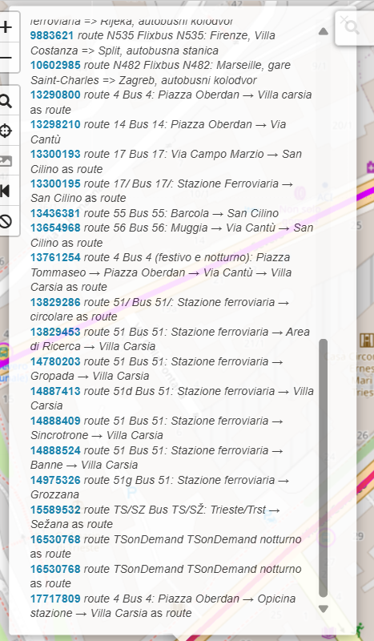
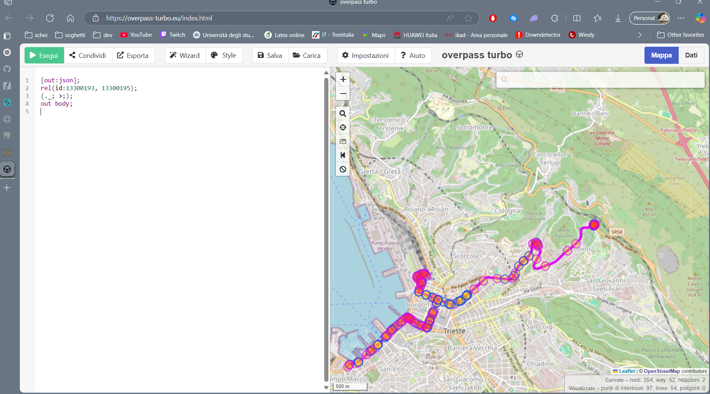

# COSA CI SERVE

1. **Accesso ai dati in tempo reale**: Per fornire informazioni aggiornate sulla posizione degli autobus, quindi i servizi di TPL FVG, anche se so che non c'è un servizio libero per avere le loro API oubbliche 
2. **Utilizzo di API di terze parti**: in caso sti cancari non le diano, trovare se ne esistono di terze parti.
3. **Normative privacy**: per fare una cosa simile probabilmente sarebbe da contattare direttamete le utorità locali per capire dove siamo limitati e dove invece possiamo agire in tranquillità.

# PACCHETTI UTILIZZATI

Sto utilizzando OpenStreetMap (OSM) come "fornitore" di informazioni, avvalendomi della loro guida sul sito, comprese di librerie e API, per ora il pacchetto che sto utilizzando è **Leaflet.js**, essendo che utilizziamo javascript: è facile da utilizzare e e per le integrazioni, ed inoltre permette di aggiungere i marker per fermate e tracciare le linee, sarà utile se integreremo il tempo reale.

# OVERPASS API
## Fermate

Con [questo sito](https://overpass-turbo.eu/index.html) posso usare il sistema per ottenere tutti i dati specifici.

Andando a leggere la guida, per ottenere tutte le fermate di Trieste ho utilizzato questa query nel loro ambiente di sviluppo:
```query 
[out:json];
area["name"="Trieste"]->.searchArea;
node["highway"="bus_stop"](area.searchArea);
out body;
```
appunto, questa cerca i nodi che hanno il tag "highway"="bus_stop" per le fermate del bus.

per ottimizzare la parte di selezionamento delle fermate, si può semplicemente importare la fermata in relazione alla linea, usando la seguente query:
```query 
[out:json];
rel(id:13300193,13300194);  // Relazioni della linea 17
node(r)->.stops;            // Trova i nodi (fermate) collegati alle relazioni
.stops out body;            // Output delle fermate
```
Dato che come esempio uso la 17, in questo caso le fermate saranno in relazione alla linea 17.

Poi con il js in pratica sistemo un marker per ogni fermata con il relativo nome in evidenza.

## Linee

Ora, le linee sono generalmente mappate come relazioni con il tag type=route e route=bus. Ora, questo comando purtroppo non mostra sulla mappa nessun tipo di segno visivo, ma rimanda in console svariate coordiante, quindi, presumo che saranno da tracciare a mano, utilzzando comandi (che devo ancora scoprire)

Per tracciare tutte le linee e poterle vedere su openstreetmap con le relative relazioni (importanti per avere i dati di ogni singola linea), si può fare cosi
```query 
[out:json];
area["name"="Trieste"]->.searchArea;
(
  relation["type"="route"]["route"="bus"](area.searchArea);
)->.routes;
(.routes; >;);
out body;
```

Ora: selezionando solo una linea (partiamo dalla 17 perchè la conosco a memoria), e, mettendo la freccia su via del coroneo (per esempio), avremo varie relazioni, che vanno dal flixbus, a linee regionali. Ora ovviamente a noi interessa solo la 17, quindi, confrontando con l'immagine

vediamo che le relazioni per la 17 sono: 13300193,13300194 e 13300195,13307218 (per la 17/).
Ottenute le relazioni, posso andare su overpass, usare la query
```query 
[out:json];
rel(id:13300193, 13300195);
(._; >;);
out body;
```
ed importare le linee della 17 e 17/.
 infatti

Per ora non so una beca di js, quindi ho semplicemente importato la 17 colorandola di blu,  e disattivando le fermate
# ORGANIZZAZIONE CODICE
## mapConfig.js

Contiene tutti i dati globali che servono per tutte le linee, in modo da importarli una volta e richiamarli solo quando necessario. Questo permetterà di creare un file per ogni linea (1,2,....17,...) e utilizzare il pacchetto solamente richiamandolo, senza dover creare una funzione per ogni file, sia per snellire il codice, sia per evitare errori di conflitto

# PROBLEMI NOTI (da risolvere)
## Linee
Parecchio pesante caricare tutte le linee con fermate, bisognerà suddividere i carichi di gestione per alleggerire il display dei dati (per esempio, non caricare tutte le linee all'inizio, ma caricare solo la linea selezionata con fermata)
## Fermate
Attualmente l'info-panel della linea funziona bene (meglio di quello che mi aspettassi), ma c'è un grave errore, le fermate sono caricate in maniera randomica. Bisognerà caricare in ordine le fermate e segnare il giro dell'autobus con andata e ritorno.

Iimplementato andata, il ritorno ha qualche discordanza con la 17, ci sono alcune fermate che non c'entrano niente ed inoltre nell'infopanel principale non vengono caricate correttamente le andate